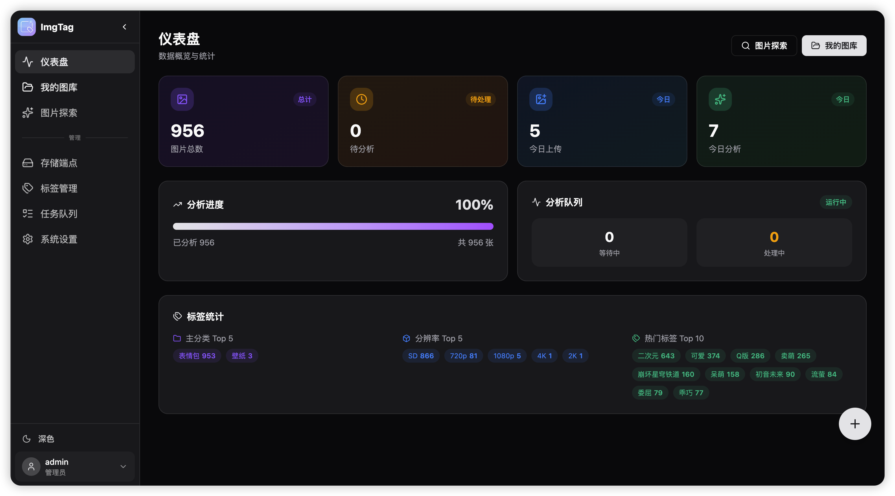
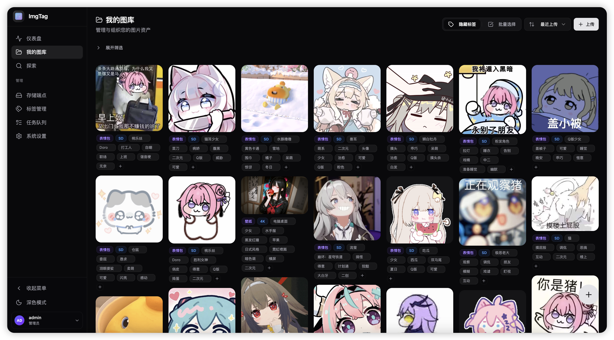
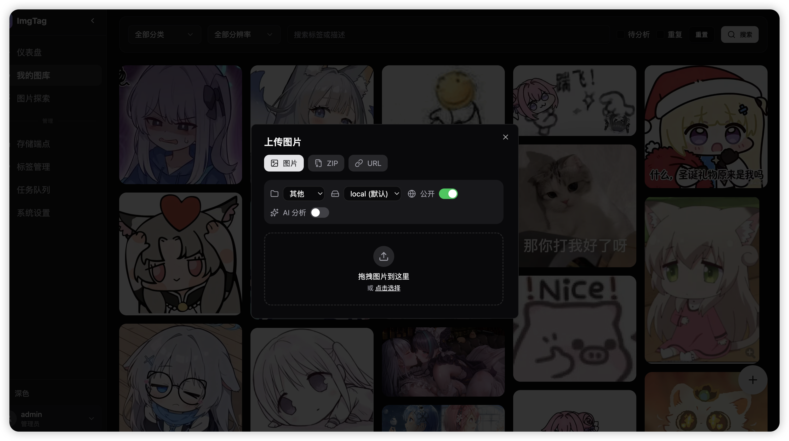
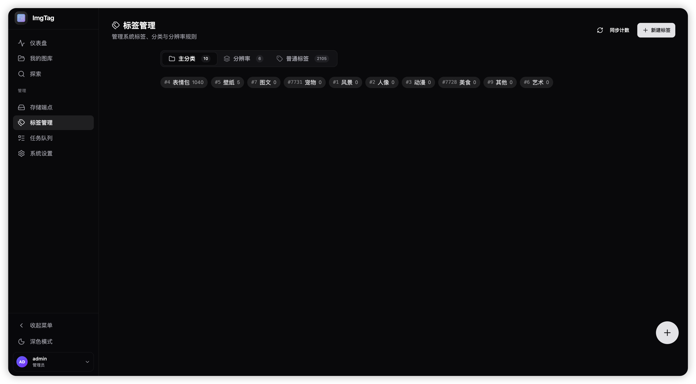
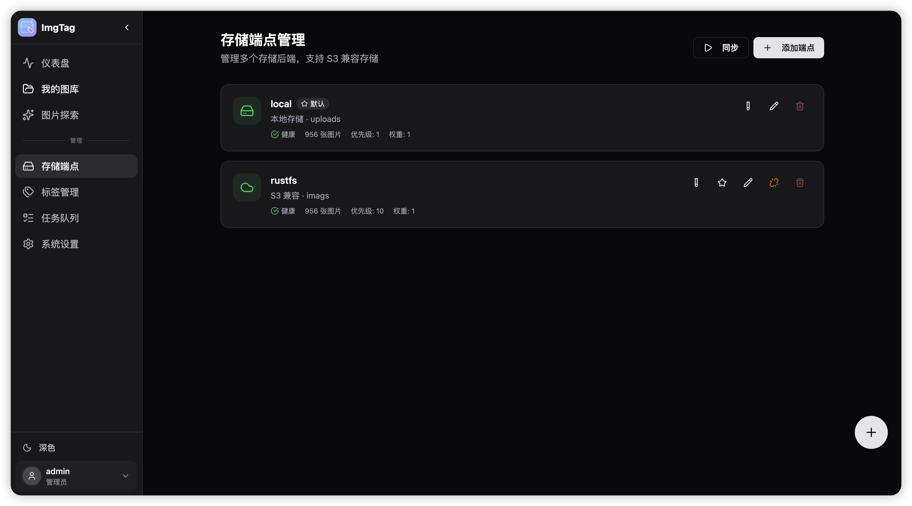
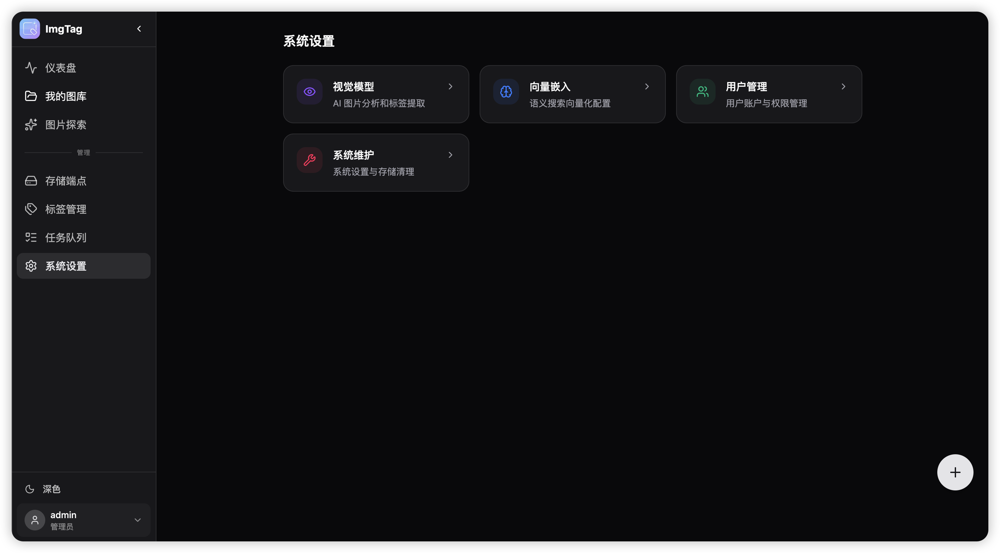

<p align="center">
  
</p>

<h1 align="center">ImgTag</h1>

<p align="center">An automatic image tagging and vector search system based on AI vision models</p>

<p align="center">
  <a href="LICENSE"></a>
  
  
</p>

<p align="center">
  <a href="README.en.md">English</a> | <a href="README.md">中文</a>
</p>

## ✨ Features

- 🤖 **AI Intelligent Tagging** - Supports vision models such as OpenAI and Gemini (via OpenAI standard API endpoints)
- 🔍 **Semantic Vector Search** - Similar image retrieval based on text descriptions
- 💾 **Multi-Endpoint Storage** - Local + S3 compatible endpoints, supporting automatic backup and synchronization
- 📁 **Favorites Management** - Hierarchical favorites with automatic tag appending
- 🏷️ **Tagging System** - Source tracking (AI/User) and usage statistics
- 👥 **User Authentication** - JWT authentication, role-based permissions, and admin account management
- 📝 **Modification Suggestions & Approval** - Non-uploaders can submit metadata change suggestions, which are implemented after admin approval (triggering vector reconstruction)
- ⚡ **Batch Operations** - Bulk upload, deletion, tagging, and AI analysis

> Default admin: `admin` / `admin123`

## 📚 Documentation

- Release History (update details for each version): [docs/release-history.md](docs/release-history.md)
- Permission bits and Suggestion/Approval guide: [docs/permissions.md](docs/permissions.md)
- More documentation index: [docs/README.md](docs/README.md)

---

<details>
<summary><b>📸 System Preview (Click to expand)</b></summary>

<table>
  <tr>
    <td width="50%">
      <h4>🏠 Dashboard</h4>
      
      <p>Data overview, analysis queue, and tag popularity rankings</p>
    </td>
    <td width="50%">
      <h4>🖼️ My Library</h4>
      
      <p>Category filtering, inline tag editing, and batch operations</p>
    </td>
  </tr>
  <tr>
    <td>
      <h4>🔍 Image Details</h4>
      
      <p>AI descriptions, tag sources, and metadata</p>
    </td>
    <td>
      <h4>✨ Image Exploration</h4>
      
      <p>Semantic search and vector similarity retrieval</p>
    </td>
  </tr>
  <tr>
    <td>
      <h4>📤 Upload Function</h4>
      
      <p>Drag-and-drop upload, ZIP import, and URL scraping</p>
    </td>
    <td>
      <h4>🏷️ Tag Management</h4>
      
      <p>Three-level tag system, source tracking, and custom prompts</p>
    </td>
  </tr>
  <tr>
    <td>
      <h4>💾 Storage Endpoints</h4>
      
      <p>Multi-endpoint configuration, S3 compatibility, and automatic backups</p>
    </td>
    <td>
      <h4>⚙️ System Settings</h4>
      
      <p>AI model configuration, embedding models, and system parameters</p>
    </td>
  </tr>
</table>

</details>

---

## 🐳 Quick Deployment

**Prerequisites**: PostgreSQL database (with `pgvector` extension enabled)

```bash
# Download configuration file
curl -O https://raw.githubusercontent.com/127Wzc/ImgTag/main/docker/docker-compose.yml

# Edit docker-compose.yml and enter your database connection string
# Start services
docker-compose up -d
```

Access: http://localhost:5173

### Image Versions

| Tag | Description | Port |
|-----|------|-----|
| `latest` | Full-stack lightweight version (Recommended) | 5173 |
| `latest-local` | Full-stack + Local embedding models | 5173 |
| `latest-backend` | Backend API only | 8000 |

### Environment Variables

| Variable | Description |
|-----|------|
| `PG_CONNECTION_STRING` | PostgreSQL connection string (Required) |

---

## 🚀 Local Development

```bash
# Backend (uses online APIs by default, no extra dependencies needed)
cp .env.example .env && vim .env  # Configure database
uv sync
uv run python -m uvicorn imgtag.main:app --reload --port 8000

# For local embedding models, install optional dependencies
uv sync --extra local

# Frontend
cd web && pnpm install && pnpm dev
```

Access: http://localhost:5173

---

## 📋 Configuration Guide

Managed via the "System Settings" in the Web interface:

| Module | Configuration Items |
|------|--------|
| Vision Model | API address, Key, Model name |
| Embedding Model | Local model / Online API |
| Storage Endpoint | Multi-endpoint management, S3 compatibility, Auto-backup |

---

## 🔌 Developer Access

| Interface | Description |
|------|------|
| [🤖 AI Integration API](docs/external-api.md) | Third-party integration supporting REST / MCP / OpenAI Tools |
| [📖 Swagger Docs](http://localhost:8000/docs) | Full backend API reference |

---

## 📊 Analytics & Statistics

Supports multi-platform analytics such as Umami and Google Analytics. For more details, see the [Frontend Configuration Guide](web/README.zh.md#分析统计).

---

## 🚀 Decoupled Deployment

To host the frontend on a CDN (Vercel / Cloudflare Pages):

1. Deploy the backend using the `latest-backend` image (Port 8000).
2. Build the frontend following the [Frontend Deployment Guide](docs/frontend-deploy.md).

For more technical details, please refer to the [System Architecture](docs/architecture.md).

---

## 📄 License

[MIT](LICENSE)
