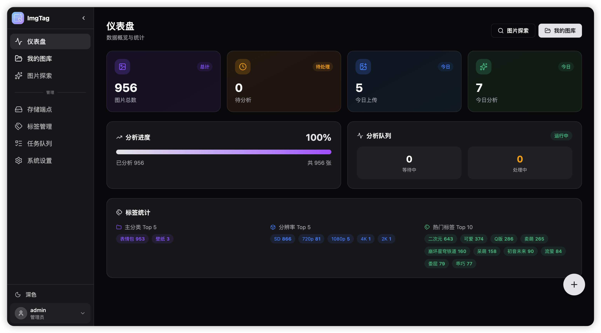
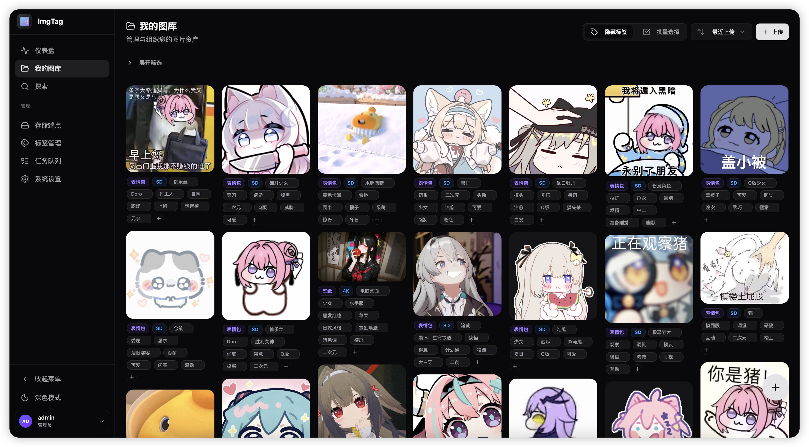
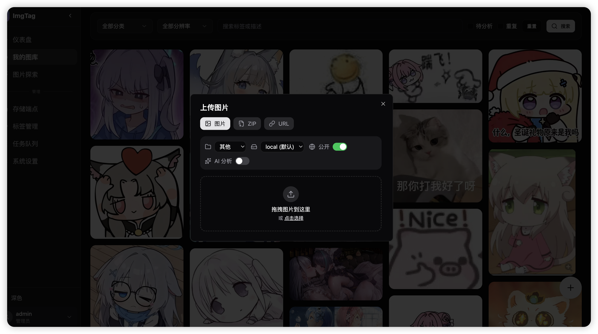
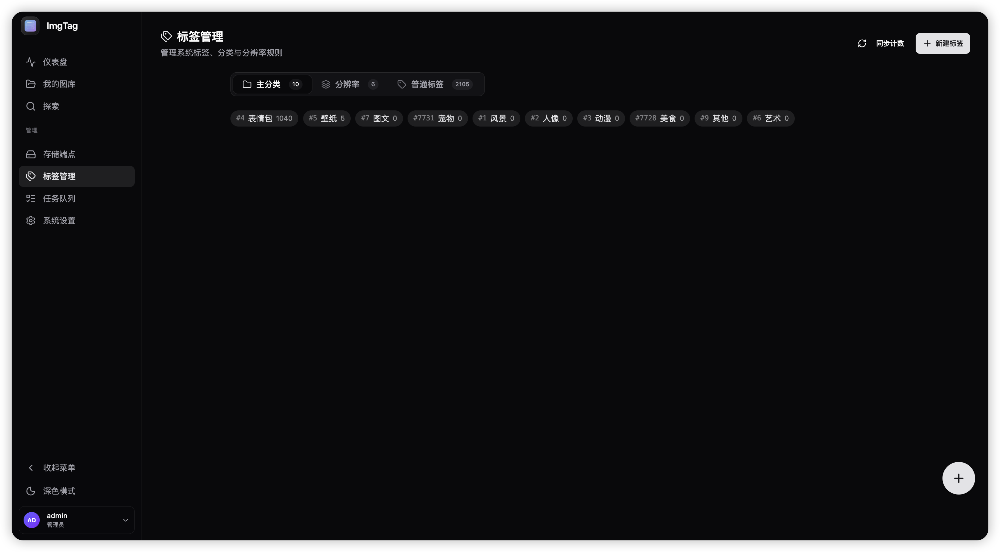
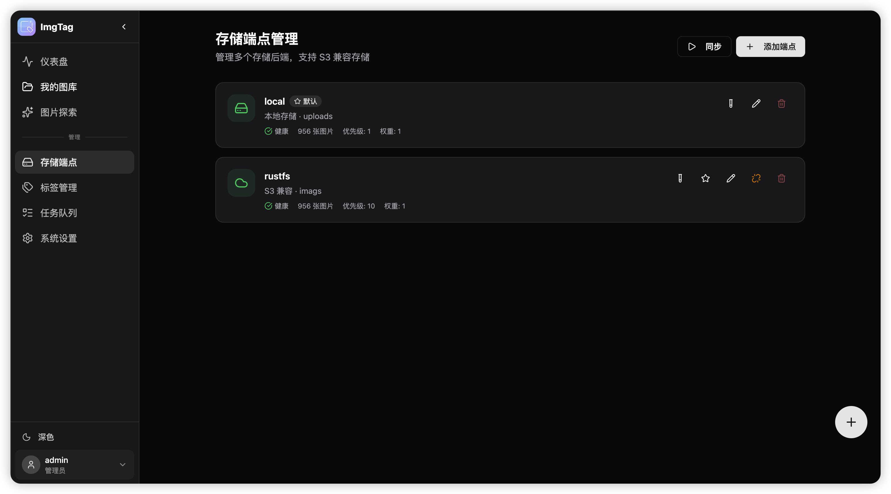
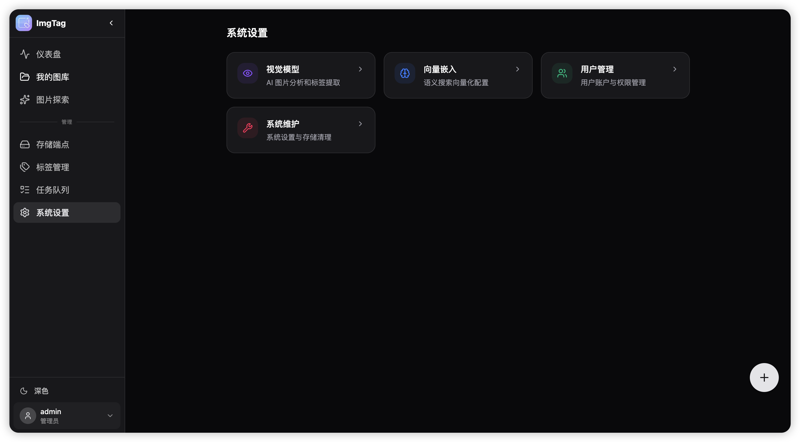

<p align="center">
  
</p>

<h1 align="center">ImgTag</h1>

<p align="center">基于 AI 视觉模型的图片标签自动生成与向量搜索系统</p>

<p align="center">
  <a href="LICENSE"></a>
  
  
</p>

<p align="center">
  <a href="README.en.md">English</a> | 中文
</p>

## ✨ 功能特性

- 🤖 **AI 智能标签** - 支持 OpenAI、Gemini 等视觉模型（OpenAI 标准 API 端点）
- 🔍 **语义向量搜索** - 基于文本描述的相似图片检索
- 💾 **多端点存储** - 本地 + S3 兼容端点，支持自动备份同步
- 📁 **收藏夹管理** - 层级收藏夹，自动追加标签
- 🏷️ **标签系统** - 来源追踪（AI/用户）、使用统计
- 👥 **用户认证** - JWT 认证、管理员审批、角色权限
- ⚡ **批量操作** - 批量上传、删除、打标签、AI 分析

> 默认管理员：`admin` / `admin123`

---

<details>
<summary><b>📸 系统预览（点击展开）</b></summary>

### 🏠 仪表盘 - 数据概览与统计



实时展示图片总数、待分析队列、今日上传/分析统计。标签使用热度 Top 排行，一目了然。

---

### 🖼️ 我的图库 - 图片管理与筛选



支持按分类、分辨率、关键词筛选图片。内联编辑标签，批量选择后可一键添加标签或删除。

---

### 🔍 图片详情 - AI 描述与标签


查看 AI 自动生成的描述、标签来源（AI/用户）、图片元信息。支持复制图片链接和编辑描述。

---

### ✨ 图片探索 - 图库浏览/智能搜索


支持图片标签、描述多维度松鼠，智能搜索输入自然语言描述，基于向量相似度检索图片描述和标签中文语义相关图片。

---

### 📤 上传功能 - 智能分析



支持拖拽上传、ZIP 批量导入、URL 抓取。可选 AI 自动分析，生成标签和描述。

---

### 🏷️ 标签管理 - 分类与统计



三级标签体系：主分类（壁纸/表情包等）、分辨率（4K/2K 等）、普通标签。显示使用次数和来源。

---

### 💾 存储端点 - 多端点配置



支持本地存储和 S3 兼容端点（MinIO、阿里云 OSS 等）。可配置主端点(上传可选)和备份同步(自动同步+定时同步备份)。支持多端点负载均衡，自动选择可用端点的图链。

---

### ⚙️ 系统设置 - AI 模型配置



配置视觉分析模型（OpenAI、Gemini 等）、嵌入模型、系统参数。

</details>

---

## 🐳 快速部署

**前提条件**：PostgreSQL 数据库（启用 pgvector 扩展）

```bash
# 下载配置文件
curl -O https://raw.githubusercontent.com/127Wzc/ImgTag/main/docker/docker-compose.yml

# 编辑 docker-compose.yml，填入数据库连接
# 启动服务
docker-compose up -d
```

访问：http://localhost:5173

### 镜像版本

| 标签 | 说明 | 端口 |
|-----|------|-----|
| `latest` | 全栈精简版（推荐） | 5173 |
| `latest-local` | 全栈 + 本地嵌入模型 | 5173 |
| `latest-backend` | 纯后端 API | 8000 |

### 环境变量

| 变量 | 说明 |
|-----|------|
| `PG_CONNECTION_STRING` | PostgreSQL 连接字符串（必填） |

---

## 🚀 本地开发

```bash
# 后端（默认使用在线 API，无需额外依赖）
cp .env.example .env && vim .env  # 配置数据库
uv sync
uv run python -m uvicorn imgtag.main:app --reload --port 8000

# 如需本地嵌入模型，安装可选依赖
uv sync --extra local

# 前端
cd web && pnpm install && pnpm dev
```

访问：http://localhost:5173

---

## 📋 配置说明

通过 Web 界面「系统设置」管理：

| 模块 | 配置项 |
|------|--------|
| 视觉模型 | API 地址、密钥、模型名称 |
| 嵌入模型 | 本地模型 / 在线 API |
| 存储端点 | 多端点管理、S3 兼容、自动备份 |

---

## 🔌 API

📖 [Swagger 文档](http://localhost:8000/docs) | [外部 API 接口](docs/external-api.md)

---

## 🚀 前后端分离部署

如需将前端托管到 CDN（Vercel / Cloudflare Pages）：

1. 使用 `latest-backend` 镜像部署后端（端口 8000）
2. 参考 [前端部署指南](docs/frontend-deploy.md) 构建前端

更多技术细节请参阅 [系统架构](docs/architecture.md)

---

## 📄 License

[MIT](LICENSE)